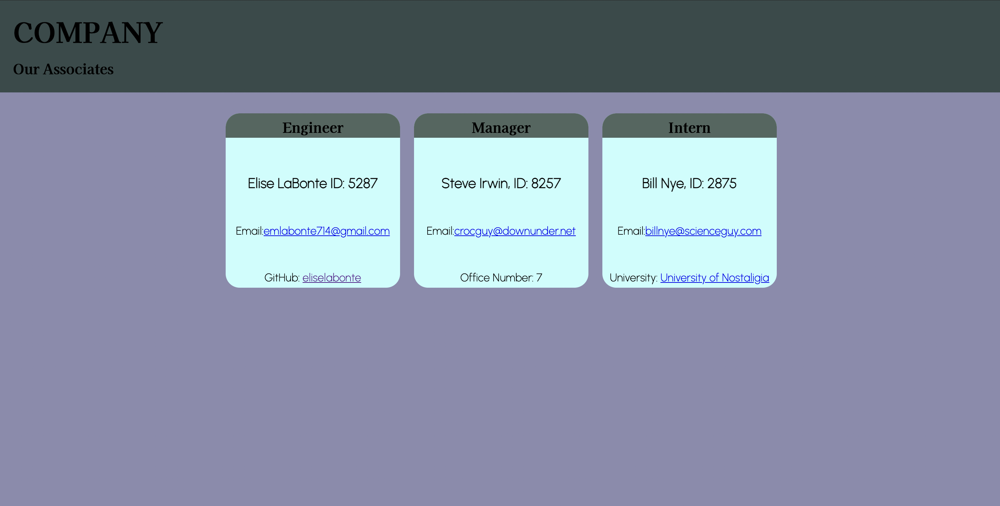

# generate-employee-info

  ## Table of Contents

  * [description](#description)

  * [installation](#installation)

  * [usage](#usage)

  * [contributing](#contributing)

  * [tests](#tests)

  ## description:
      this is a command-line application that takes in information about employees and generates an html document.

      follow the prompts to create custom employee cards.
      when finished, answer 'no more new employees' and the HTML document will be created with a corresponding CSS file.

  ## installation:
      open the application from the command-line using 'node index.js'

  ## usage:
      create a custom employee directory.

  ## contributing:
      Elise LaBonte

  ## tests:
      tests are written for the 'Manager', 'Engineer', and 'Intern' classes.

  
